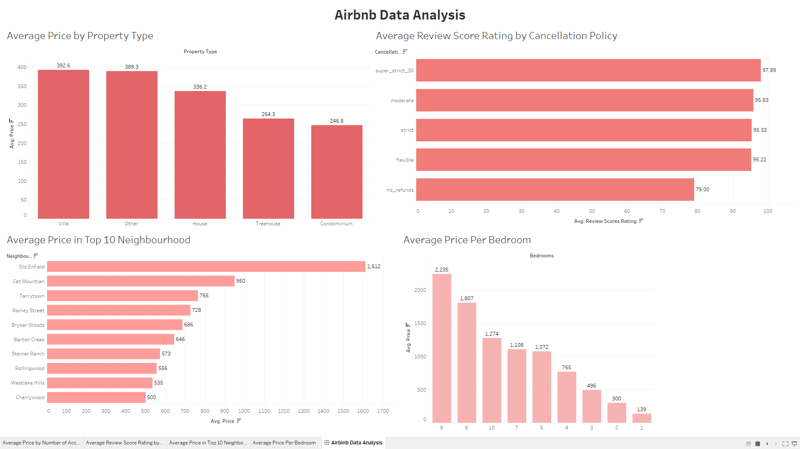
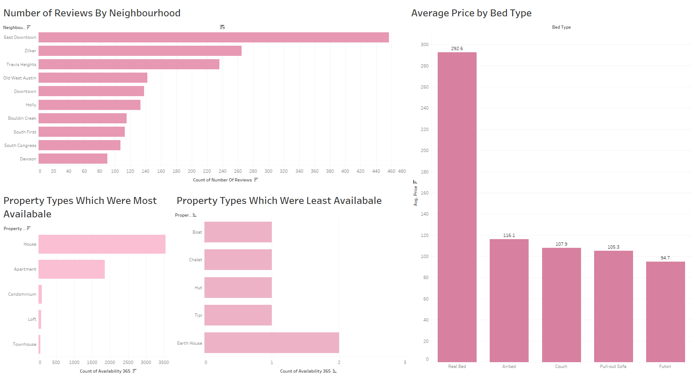
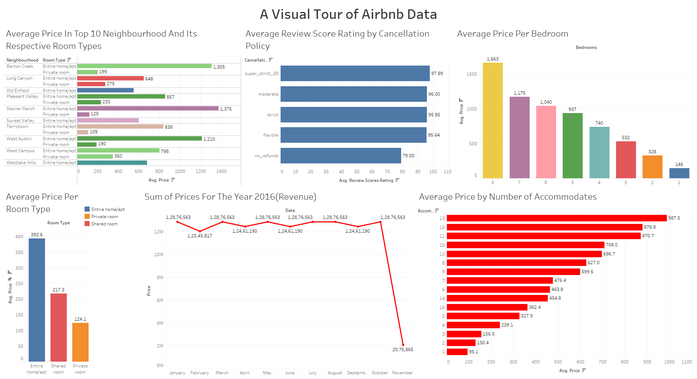

# 🏠 Texas Airbnb Dashboard

This repository contains a Tableau dashboard project analyzing Airbnb listings data in Texas. The objective of this project is to uncover insights about pricing trends, property types, neighborhood popularity, availability, and review ratings.

---

## 📊 Dashboards Overview

Three dashboards were created using Tableau:

---

### 🔹 1. **Airbnb Data Analysis**
This dashboard provides a comprehensive view of:
- **Average Price by Property Type** – Villas and "Other" properties have the highest average prices.
- **Average Price in Top 10 Neighborhoods** – Neighborhoods like Old Enfield and Cat Mountain top the list.
- **Average Price per Bedroom** – Listings with 8 or more bedrooms have significantly higher average prices.
- **Average Review Score by Cancellation Policy** – Listings with a ‘super_strict_30’ policy have the highest average ratings.

---

### 🔹 2. **Availability & Review Dashboard**
This dashboard focuses on:
- **Number of Reviews by Neighborhood** – East Downtown and Zilker have the most guest reviews, indicating popularity.
- **Average Price by Bed Type** – Real Beds dominate in both price and usage.
- **Most Available Property Types** – Houses and Apartments are the most available across the year.
- **Least Available Property Types** – Unique options like Boats, Chalets, and Tipis are rarely listed.

---

### 🔹 3. **Pricing Breakdown Dashboard**
This dashboard presents a detailed breakdown of pricing across multiple attributes:
- **Bedrooms** – Visualizes how price scales with the number of bedrooms.
- **Neighborhoods** – Shows which areas command premium pricing.
- **Property Types** – Compares average prices across different property categories.
- **Bed Types** – Highlights price variations by the type of bed offered.

This view is especially helpful for potential hosts or investors to assess pricing potential based on listing features.

---

## 📁 Datasets Used

The following datasets were used for building the dashboards:

- `listings_summary.csv`: Includes summarized listing data like price, room type, reviews, etc.
- `neighbourhood.csv`: Contains geographic information and names of neighborhoods.
- `listings.csv`: Detailed Airbnb listing data including availability, amenities, and property features.

> 📌 *Note: The data was preprocessed and cleaned before uploading into Tableau for visualization.*

---

## 🛠️ Tools Used

- **Tableau** – For building the interactive dashboards.
- **Microsoft Excel / CSV Tools** – Used for initial data exploration and cleaning.
- **Jupyter Notebook / Python ** – For preprocessing and data transformations.

---

## 📷 Dashboard Snapshots

| Dashboard 1: Airbnb Data Analysis | Dashboard 2: Availability & Review | Dashboard 3: Pricing Breakdown |
|----------------------------------|-----------------------------------|-------------------------------|
|  |  |   |

---

## 📌 Key Insights

- Villas, houses, and unique neighborhoods demand premium pricing.
- Stricter cancellation policies are associated with better reviews.
- Properties with Real Beds are priced highest and most frequently offered.
- Houses and apartments are the most available listings throughout the year.
- Unique property types like boats and tipis are rare and may offer niche value.

---

## 📬 Author

**Akshay Damodar Prabhu**  
🔗 [GitHub Profile](https://github.com/Akshayd-05)  
📫 [Email](mailto:your-email@example.com)

---

⭐️ *If you found this project useful, consider giving it a star!*
